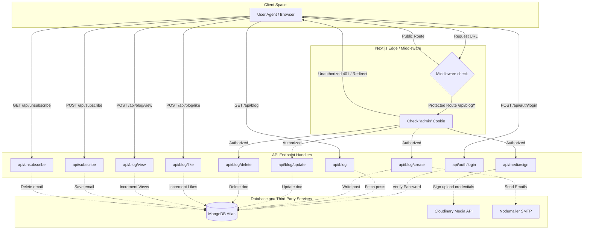
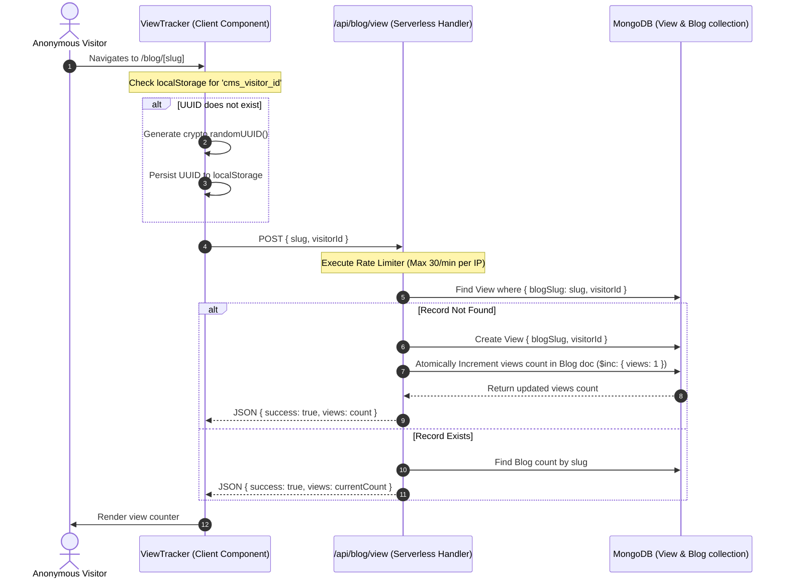
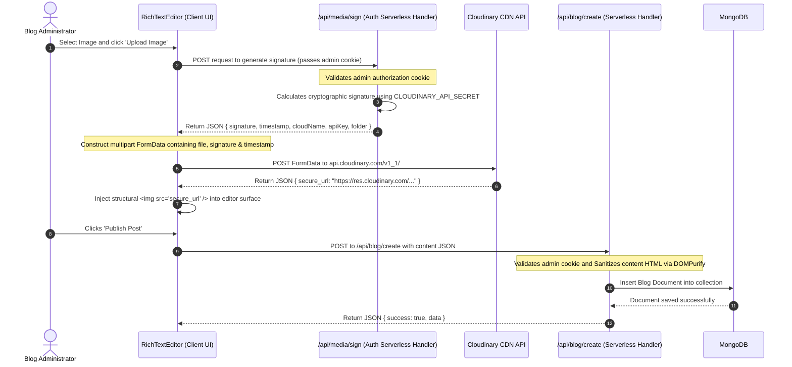

# System Architecture: CMS

This document explains the technical architecture, component breakdown, and runtime structure of the CMS application. It provides future AI models and developers with an exact mapping of how client-side modules, serverless backend APIs, caching layers, and external integrations interact.

---

## 1. Technical Stack Overview

- **Core Framework**: Next.js 16.2.3 (App Router)
- **Runtime Engine**: React 19.2.4
- **Database Engine**: MongoDB / Mongoose ODM (9.4.1)
- **Styling Pipeline**: TailwindCSS v4 + PostCSS (@tailwindcss/postcss) + Vanilla CSS Variables
- **Cryptographic Library**: bcryptjs (3.0.3)
- **Sanitization Layer**: isomorphic-dompurify (3.15.0)
- **Media Hosting**: Cloudinary API (2.10.0)
- **Transactional Mailer**: Nodemailer (8.0.5)

---

## 2. Frontend Architecture

The frontend is structured around Next.js App Router conventions. It leverages Server Components for high-performance initial loading and SEO, and Client Components for dynamic, state-driven widgets.

### A. Routing and Pages
The layout structure under `src/app` maps to the following routes:
- **`/` (Home)**: Server Component. Pulls the latest 3 blog posts directly from MongoDB. Uses Incremental Static Regeneration (`revalidate = 60`) to serve pre-rendered HTML from edge nodes while maintaining freshness.
- **`/blogs` (Blog Directory)**: Client Component (`"use client"`). Fetches all posts concurrently from `/api/blog?excludeContent=true`. Filtering, sorting, and title search are performed entirely client-side for immediate response times.
- **`/blog/[slug]` (Blog Detail)**: Server Component. Fetches a specific post by slug. Revalidates at most once every 60 seconds (`revalidate = 60`). Employs `generateStaticParams()` at build time to pre-generate pages for existing posts.
- **`/contact` (Contact Page)**: Server Component providing social networking details, using a nested Client Component `SubscribeForm`.
- **`/admin/login` (Authentication)**: Client Component capturing the administrative password.
- **`/admin` (Admin Panel)**: Server Component wrapper. Performs a server-side cookie check. If authorized, renders the interactive `AdminClient` dashboard.

### B. Core Styling & Theming System
The site styling is configured via TailwindCSS v4 and global classes defined in [globals.css](file:///c:/Users/bolli/OneDrive/Desktop/CMS/my-cms/src/app/globals.css).

1. **Theme Switching**: Enforced through class injection on `document.documentElement` (`.dark`).
2. **Design Tokens**: Colors are mapped to custom CSS variables, dynamically altering the UI theme:

```css
/* Light Mode Variables (Default) */
:root {
  --bg: #fcde7b;          /* Vibrant Yellow/Gold Paper */
  --text: #383c45;        /* Dark Slate */
  --card: #fae0a0;        /* Soft Amber Card */
  --muted: #000000;       /* Solid Black */
  --border: #ffa600;      /* Dark Amber Border */
  --accent: #ffa200;      /* Orange Highlight */
  --accent-soft: #b8f2e6;
  --highlight: #ff0000;
  --font-display: "Underwood", serif;
}

/* Dark Mode Variables */
.dark {
  --bg: #0b090a;          /* Deep Onyx Black */
  --text: #fffef0;        /* Warm White Smoke */
  --card: #0a273c;        /* Midnight Carbon Blue */
  --muted: #b1a7a6;       /* Silver Grey */
  --border: #2a2a2a;      /* Slate Grey Border */
  --accent: #e5383b;      /* Crimson Strawberry Red */
  --accent-soft: #ba181b; /* Mahogany Dark Red */
  --highlight: #a4161a;   /* Ruby Deep Red */
}
```

3. **Typography**:
   - Headers use the `Playfair_Display` serif font (`--font-heading`).
   - The logo and banners load a local custom font, `Underwood Champion` (`--font-display`), loaded as a static `.woff` asset.
   - Body copy utilizes `Source_Sans_3` (`--font-body`).

---

## 3. Backend Architecture

The backend consists of serverless Next.js API route handlers (`src/app/api/...`) that connect to MongoDB via Mongoose.



### A. Database Connection Caching
To prevent exhausting database connection pools during serverless executions, the application caches the MongoDB connection in the Node global context ([db.ts](file:///c:/Users/bolli/OneDrive/Desktop/CMS/my-cms/src/lib/db.ts)). If a connection promise already exists across serverless invocations, it is reused.

### B. Middleware Authorization Guard
The [middleware.ts](file:///c:/Users/bolli/OneDrive/Desktop/CMS/my-cms/src/middleware.ts) file acts as the primary firewall for the application.

- **Scope**: Matches routes beginning with `/admin/:path*` (excluding `/admin/login`) and mutating API routes `/api/blog/create`, `/api/blog/delete`, and `/api/blog/update`.
- **Enforcement**: Extracts the cookie named `admin`. If the cookie is absent or not set to `"true"`, it blocks execution:
  - Page routes: Returns a `307 Temporary Redirect` to `/admin/login`.
  - API endpoints: Returns a `401 Unauthorized` JSON payload.

---

## 4. End-to-End System Integration Flows

### A. Interactive Post View Tracking


### B. Image Upload & Post Saving

