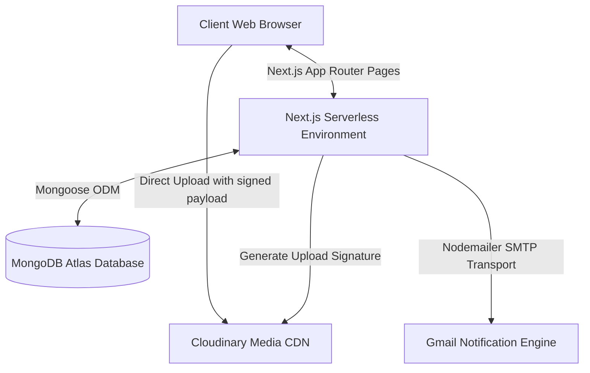

# Project Context: CMS (https://tejwrites.vercel.app)

Welcome to the **CMS** context layer. This document serves as the high-level onboarding manual for any AI model or developer stepping into the repository. It outlines the core purpose of the project, user flows, and provides a structural system overview.

---

## 1. Project Purpose

The **CMS** project is a lightweight, high-performance, and visually responsive personal portfolio and Content Management System (CMS) built for **Naga Sai Teja Bollimuntha** (deployed at [tejwrites.vercel.app](https://tejwrites.vercel.app)). 

It serves a dual purpose:
1. **Public Portfolio & Blog**: A place where visitors can read articles written by Naga Sai Teja covering **Tech**, **Fitness**, **Life**, and **Motivation**.
2. **Admin Portal (Headless-Lite CMS)**: A secure space for the author to write, edit, delete articles, and manage rich media uploads (images, videos, audio) directly in a custom-built editor.

---

## 2. Key Target Audience & Personas

```
┌─────────────────────────────────────────────────────────────────────────┐
│                              SYSTEM USERS                               │
├────────────────────┬────────────────────┬───────────────────────────────┤
│ Persona            │ Access Scope       │ Primary Activity              │
├────────────────────┼────────────────────┼───────────────────────────────┤
│ Anonymous Visitor  │ Public pages       │ Reading, Searching, Liking    │
│ Newsletter Sub     │ Public & Email     │ Receiving new post alerts     │
│ Blog Admin         │ Protected panel    │ Authoring, Editing, Media Mgmt│
└────────────────────┴────────────────────┴───────────────────────────────┘
```

---

## 3. Core User Flows

The application defines three main operational user loops:

### A. The Visitor/Reader Flow
1. **Entry**: The visitor lands on the Homepage (`/`), which loads static elements (about text, social links, profile card) and lists the **3 most recent blog posts** cached via Incremental Static Regeneration (ISR).
2. **Browsing**: The visitor clicks "View All Blogs" or navigates to `/blogs`. Here, they can search posts by title in real-time, filter by category (`tech`, `fitness`, `life`, `motivation`), and sort by chronological order (`latest`, `oldest`).
3. **Reading**: Clicking a blog title routes the user to `/blog/[slug]`. 
   - A unique view registration is triggered in the background using a persistent client-side UUID.
   - The blog content is dynamically sanitized on the server and rendered as rich HTML.
4. **Interaction (Liking)**: The visitor can toggle a like on the post. The system updates the UI optimistically and syncs both the browser's `localStorage` (to track liked states) and the server's MongoDB counter via API.
5. **Subscription**: The visitor inputs their email address into the `SubscribeForm` present on the homepage, blog footer, or contact page to join the newsletter.

### B. The Subscriber Notification Loop
1. **Sign Up**: The user subscribes. Their email is saved into the database if not already present.
2. **Publish Alert**: When the Admin publishes a new blog post, the server initiates an asynchronous notification routine. It loops through all subscribers, constructs a personalized, responsive HTML email template using Gmail SMTP via Nodemailer, and emails them.
3. **Unsubscription**: Every email contains a uniquely generated unsubscribe link:
   `/api/unsubscribe?email=<encoded-email>`
   Clicking this routes the subscriber to a server-rendered HTML page that deletes their database entry and displays a success message.

### C. The Administrator CMS Flow
1. **Access**: The administrator navigates to `/admin`.
2. **Security Interception**: The Next.js routing middleware detects if the `admin` cookie is set to `true`. If not, it redirects the browser to `/admin/login`.
3. **Authentication**: The admin inputs the password. The system compares it using `bcrypt` against a pre-hashed key (`ADMIN_PASSWORD_HASH`) stored in server variables. On success, it issues a secure, `httpOnly`, `sameSite: strict` session cookie valid for 8 hours.
4. **Content Production**: 
   - The admin writes posts in a custom-built rich text editor.
   - Media (images, videos, audio) is uploaded directly to Cloudinary. The client fetches a short-lived signature from `/api/media/sign` and posts files securely from the browser.
5. **Management**: The admin edits current posts (modifications automatically update title, category, tags, content, and regenerate the URL slug) or deletes them with an interactive confirmation prompt.

---

## 4. High-Level System Architecture

The project utilizes a modern serverless stack configured for speed, reliability, and security:



- **Frontend**: Next.js App Router (React 19) styled with TailwindCSS v4 and custom dark/light style sheets. Employs Incremental Static Regeneration (ISR) to cache pages at the network edge with 60-second revalidation cycles.
- **Database Layer**: MongoDB Atlas mapped via Mongoose models. Utilizes compound indexes for rapid query processing and TTL indexes for automatic rate limiter cleanup.
- **Asset Host**: Cloudinary handles storage and streaming configurations for images, videos, and raw audio files.
- **Mailer**: Nodemailer handles outbound transactional emails via a Gmail SMTP transport bridge.
